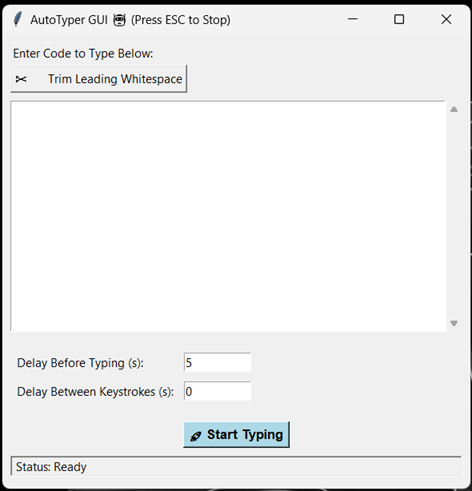

# ✒️ Auto Typer

A simple and convenient Python tool to automatically type out predefined text with a natural, human-like feel. It's perfect for situations where you need to input text by simulating keystrokes rather than pasting, such as in presentations, demos, or specific applications.



## ✨ Features

* **Natural Typing Simulation**: Types out any given text character by character, not instantly pasting it.
* **User-Friendly GUI**: Comes with a simple graphical user interface for easy operation.
* **Customizable Delays**:
    * Set a startup delay before typing begins.
    * Adjust the time delay between each keystroke to control the typing speed.
* **Whitespace Trimming**: Automatically removes leading whitespace from your input text. This is particularly useful when you need to enter code into an editor with auto-indentation.
* **Versatile Use**: Helpful for any text field, especially in environments where you want to avoid using the paste function.

## 🚀 Getting Started

You can run Auto Typer in two ways: as a standalone executable or directly from the Python script.

### Prerequisites

To run the Python script, you will need to have Python installed on your system.
* [Download Python](https://www.python.org/downloads/)

No prerequisites are required for the standalone `AutoTyper.exe`.

## ⚙️ How to Run

### 1. Standalone Program (Windows)

The easiest way to get started on Windows.

* Download the `AutoTyper.exe` file.
* Double-click the file to run it. No installation is needed.

### 2. From Python Script

This method works on any operating system with Python installed.

1.  **Clone the repository:**
    ```sh
    git clone https://github.com/asmeet3/auto-typer.git
    cd auto-typer
    ```
2.  **Run the script:**
    ```sh
    python script.py
    ```

## 📋 How to Use

1.  Launch the application using one of the methods above.
2.  Paste or type the text you want to be auto-typed into the text area.
3.  (Optional) Set a "Delay Before Typing" in seconds.
4.  (Optional) Set the "Delay Between Keystrokes" in seconds (e.g., `0.1` for fast typing, `0.5` for slow typing).
5.  Place your cursor in the text field where you want the text to be typed.
6.  Click the "Start Typing" button in the Auto Typer window.
